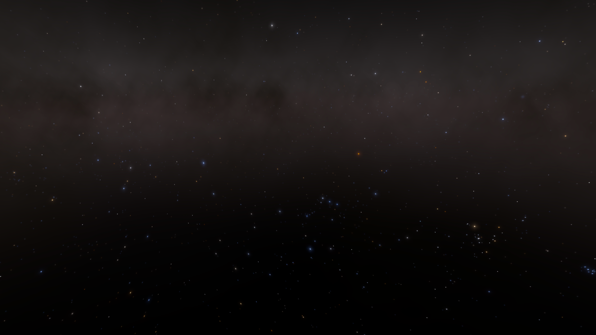
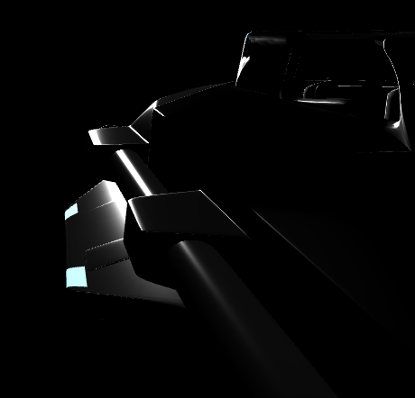
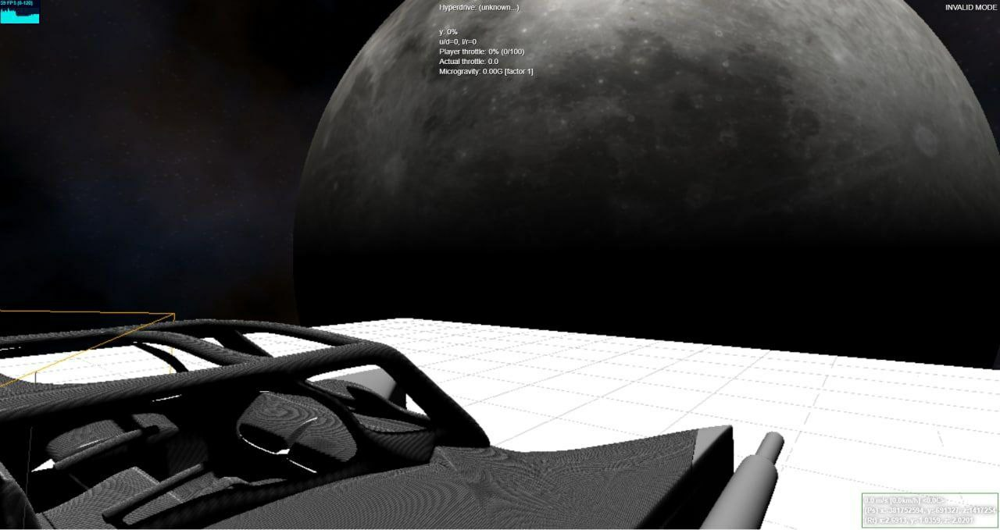
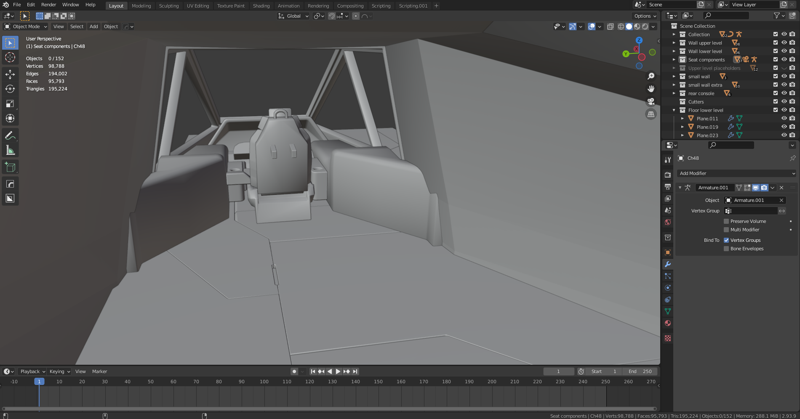

## Showcase and screenshots

### Disclaimer
When I first recorded the below, a lot of them were only intended for friends
and family. I've since realised these make for a pretty good showcase, although
some were unfortunately recorded by pointing a phone at a computer screen.

Due to the project still being in early stages of development, much of these
visuals require writing special code to make visible. Writing code just to
reproduce a showcase takes time, yet these features will eventually reveal
themselves naturally as the code evolves. For that reason I feel the poor
quality showcase is acceptable for now. This will be revised in future to have
a more professional feel.

All below images generated using the
[Cosmosis game engine](https://github.com/frostoven/Cosmosis/) (unless
otherwise stated).

## Early stages

### Demo
Very first gif recorded to show literally anything. In this image, the Sun,
Moon, and Earth are to scale and have real-world distance. Their rotations are
wrong, though, and the scene doesn't have proper lighting set up.

### Getting stars right

Getting stars right was tough. I had to crash course an astronomy course to get
some basic stuff going.

I started by rendering 10,000 random dots. This number was chosen because we
can, at most, see 9,110 stars at night with the naked eye assuming ideal
conditions (incidentally, my machine could handle 1 million dots before things
would start crawling).

Random dots to simulate a basic starfield:

Accompanying video:

* [starfield.mp4](showcase/first_starfield.mp4)

### True star positions

I could not find a catalogue that contained all Earth-visible stars
(with 3D positions), so I
[made one myself](https://github.com/frostoven/BSC5P-JSON-XYZ). It took waaayyy
too long to make (50 days). Luckily it does the job.

Here is an early experiment rendering it:

### Generating true star colour

Star colour needs to mimic Planck's law if you want stars to look good (I
learned this the hard way after first trying generic fade-ey dots). This is the
final result I ended up with, generated via shader:

Combining the shader with actual star positions we created earlier,
things start looking interesting:

Indeed, do a Google search for Orion's Belt and decide for yourself if this
screenshot looks like a real photo:

Initial work on Milky Way cloud generation:

## Graphics

### Random screenshots taken during development

God rays and lighting tests:

In the following screenshot, the ship's shadow is all messed due to
accidentally calculating backfaces, making it look like a type of carbon
fibre:

## Modelling

All screenshots and videos in this section taken from Blender. Blender is
currently used exclusively for all modelling.

### Ships currently being worked on
_Following screenshots taken from Blender_

First spaceship ever made for the game, the DS69F:
<!--
  This is in the reference to the Deep Space 69 cartoon, where they find an
  abandoned two-seater spaceship. This ship was inspired by that ship.
-->

Some remastering after a few months:

Second ship ever made for the game. It's still under construction:

Accompanying video:

* [CELL57.mp4](showcase/CELL57.mp4)

Another ship currently being worked on is the Scorpion-D:

Video showcasing internals:

* [maintenance access.mp4](showcase/scropion_d_maintenance.mp4)

### Random screenshots taken during development

### Initial experiments with ship power

Overloading the power grid causes other parts to malfunction. In this case,
the lights dim when adding a massive power drain:

### Texture experiments

These will probably never make it into the game, but they served as good
entertainment, so I decided to add them here.

Jungle Gym style:

Space Tractor:

Cloth Ship:

